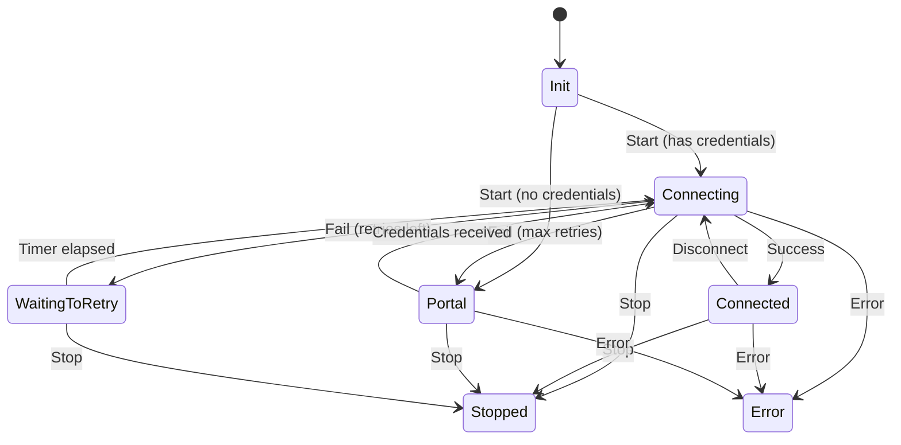

# ESP32-WiFiManager

Reusable ESP-IDF WiFi manager component with automatic connection, retry backoff, and captive portal provisioning.

## Features

- Automatic station connection using stored NVS credentials
- Exponential backoff reconnection with configurable retries
- Captive portal fallback with SoftAP, DNS hijack, and embedded web UI
- Self-running FreeRTOS task (`WifiManagerTask`) — no manual event loop needed
- Clean state-machine architecture with callback notifications
- WiFi network scanning for the provisioning UI
- NVS-backed credential persistence
- Pure C++17, no external dependencies beyond ESP-IDF

## State Machine

<details>
<summary>State transition diagram</summary>



</details>

## Quick Start

```cpp
#include "esp32_wifi_manager/WifiManagerTask.hpp"

esp32_wifi_manager::WifiManagerTask wifiTask;

void OnStateChanged(esp32_wifi_manager::WifiState state, void*) {
    // Handle state changes
}

extern "C" void app_main() {
    nvs_flash_init();

    esp32_wifi_manager::WifiManagerConfig config;
    config.apSsidPrefix = "MyDevice-";

    wifiTask.Init(config, &OnStateChanged, nullptr);
    wifiTask.Start();
}
```

## Installation

**Git submodule:**

```bash
git submodule add https://github.com/MootSeeker/ESP32-WiFiManager.git components/esp32_wifi_manager
```

**ESP-IDF component (via `idf_component.yml`):**

```yaml
dependencies:
  esp32_wifi_manager:
    git: https://github.com/MootSeeker/ESP32-WiFiManager.git
```

**Manual:** Clone or copy this repository into your project's `components/` directory.

## Configuration Reference

| Field | Type | Default | Description |
|-------|------|---------|-------------|
| `nvsNamespace` | `const char*` | `"wifi_mgr"` | NVS namespace for credential storage |
| `apSsidPrefix` | `const char*` | `"ESP32-WiFiMgr-"` | SoftAP SSID prefix (MAC suffix appended) |
| `portalPort` | `uint16_t` | `80` | HTTP server port for captive portal |
| `apMaxConnections` | `uint8_t` | `4` | Max simultaneous SoftAP connections |
| `maxConnectAttempts` | `uint8_t` | `5` | Station connection retries before portal fallback |
| `connectTimeoutMs` | `uint32_t` | `15000` | Connection attempt timeout |
| `initialReconnectDelayMs` | `uint32_t` | `1000` | First retry delay (doubles each attempt) |
| `maxReconnectDelayMs` | `uint32_t` | `30000` | Maximum retry delay cap |

## API Overview

| Class / Type | Description |
|---|---|
| `WifiManagerTask` | Primary integration point. Self-running FreeRTOS task that owns the WiFi manager lifecycle. |
| `WifiManager` | Lower-level API for manual event loop control. |
| `WifiManagerConfig` | Configuration struct passed to `Init()`. |
| `WifiState` | Enum representing connection states. |
| `WifiStateChangedCallback` | Callback type for state transition notifications. |

## Repository Layout

```text
include/esp32_wifi_manager/
    WifiManager.hpp
    WifiManagerTask.hpp
    WifiManagerTypes.hpp
    WifiManagerEspIdfAdapter.hpp
    WifiManagerStateMachine.hpp
    WifiManagerEventQueue.hpp
    WifiRetryScheduler.hpp
    WifiCredentialStore.hpp
    WifiScanService.hpp
    CaptivePortalDns.hpp
    CaptivePortalHttp.hpp
src/
    WifiManager.cpp
    WifiManagerTask.cpp
    WifiManagerEspIdfAdapter.cpp
    WifiManagerStateMachine.cpp
    WifiCredentialStore.cpp
    WifiScanService.cpp
    CaptivePortalDns.cpp
    CaptivePortalHttp.cpp
    portal_html.h
resources/
    portal.html
examples/basic/
    main/main.cpp
tests/
    WifiManagerStateMachine.test.cpp
```

## Building

**Example project:**

```bash
cd examples/basic && idf.py build
```

**Host tests:**

```bash
cd tests && cmake -B build && cmake --build build && ./build/wifi_manager_state_machine_tests
```

## Requirements

- ESP-IDF v5.0+
- C++17 compiler
- Supported targets: ESP32, ESP32-S2, ESP32-S3, ESP32-C3

## License

MIT — see [LICENSE](LICENSE) for details.